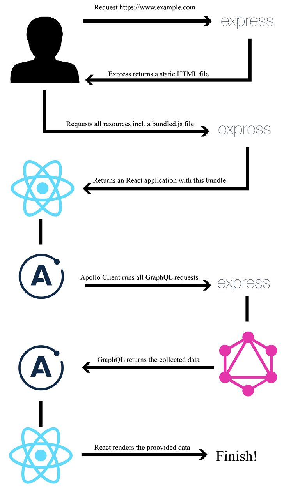
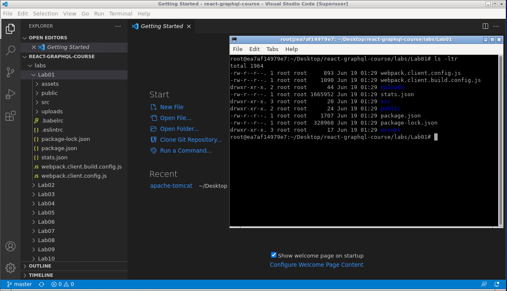
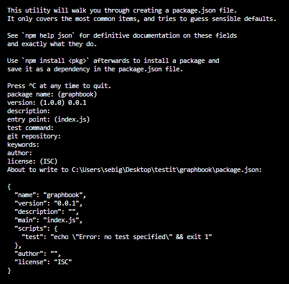
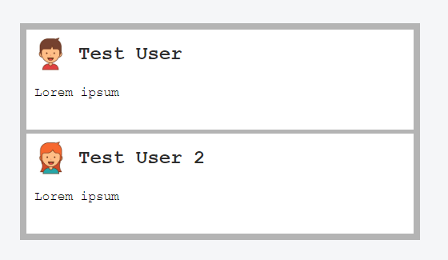
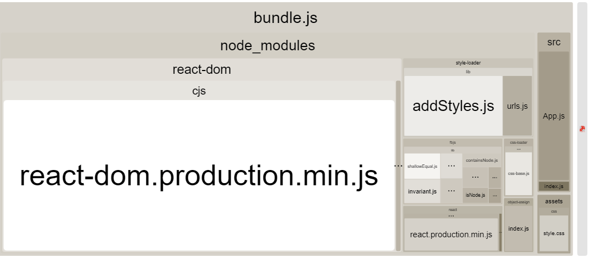

Lab 1: Preparing Development Environment
======================================


This lab covers the following topics:

-   Building the React and GraphQL stack
-   Installing and configuring Node.js
-   Setting up a React development environment with webpack, Babel, and
    other requirements
-   Using `webpack-bundle-analyzer` to check the bundle size


The basic setup
---------------

The basic setup to make an application work is the logical request flow,
which looks as follows:




### Lab Solution

Complete solution for this lab is available in the following directory:

`cd ~/Desktop/react-graphql-course/labs/Lab01`

Install following command to install all required packages:

`npm install`


**Note:** 

- VCode is already installed in the lab environment, you can open solution folder in vscode.
- Use Midori browser installed in the lab environment for accessing application.




Installing and configuring Node.js
==================================


Following commands will install Node.js and the build tools for native modules: 

```
curl -sL https://deb.nodesource.com/setup_12.x | sudo -E bash –
sudo apt-get install -y nodejs build-essential
```

<span style="color:red;">Node 12 has been installed already in the lab environment.</span>

3.  Finally, let\'s open a terminal now and verify that the installation
    was successful:

```
node --version
```

**ProTip**

The installation of Node.js via the package manager automatically installs npm.

```
npm --version
```

Setting up React
================

The development environment for our project is ready. In this section,
we are going to install and configure React, which is one primary aspect
of this course. Let\'s start by creating a new directory for our project:

```
mkdir ~/graphbook
cd ~/graphbook
```


Our project will use Node.js and many npm packages. Create a
[package.json] file to install and manage all of the dependencies
for our project.

This stores information about the project, such as the version number,
name, dependencies, and much more.

Just run [npm init] to create an empty [package.json] file:

```
npm init
```


Npm will ask some questions, such as asking for the package name, which
is, in fact, the project name. Enter [Graphbook] to insert the
name of your application in the generated [package.json] file.

I prefer to start with version number 0.0.1 since the default version
number npm offered with 1.0.0 represents the first stable release for
me. However, it is your choice which version you use here.

You can skip all other questions using the *Enter* key to save the
default values of npm. Most of them are not relevant because they just
provide information such as a description or the link to the repository.
We are going to fill the other fields, such as the scripts while working
through this course. You can see an example of the command line in the
following screenshot:





The first and most crucial dependency for this course is React. Use npm to
add React to our project:

```
npm install --save react react-dom
```


This command installs two npm packages from
[https://npmjs.com](https://npmjs.com/) into our project folder under
[node\_modules].

Npm automatically edited our [package.json] file since we provided
the [\--save] option and added those packages with the latest
available version numbers.

You might be wondering why we installed two packages although we only
needed React. The [react] package provides only React-specific
methods. All React hooks, such as [componentDidMount],
[componentWillReceivesProps], and even React\'s component class,
come from this package. You need this package to write React
applications at all.

In most cases, you won\'t even notice that you have used
[react-dom]. This package offers all functions to connect the
actual DOM of the browser with your React application. Usually, you use
[ReactDOM.render] to render your application at a specific point
in your HTML and only once in your code. We will cover the rendering of
React in a later lab.

There is also a function called [ReactDOM.findDOMNode], which
gives you direct access to a [DOMNode], but I hardly discourage
using this since any changes on [DOMNodes] are not available in
React itself. I personally have never needed to use this function, so
try to avoid it if possible.


Preparing and configuring webpack
---------------------------------

Our browser requests an [index.html] file when accessing our
application. It specifies all of the files that are required to run our
application. We need to create the [index.html], which we serve as
the entry point of our application:

1.  Create a separate directory for our [index.html] file:

```
mkdir public
touch index.html
```


2.  Then, save this inside [index.html]:

```
<!DOCTYPE html>
<html lang="en">
  <head>
    <meta charset="UTF-8">
    <meta name="viewport" content="width=device-width, initial-
      scale=1.0">
    <meta http-equiv="X-UA-Compatible" content="ie=edge">
    <title>Graphbook</title>
  </head>
  <body>
    <div id="root"></div>
  </body>
</html>
```


As you can see, no JavaScript is loaded here. There is only [div]
with the [root] id. This [div] tag is the DOMNode in which
our application will be rendered by [ReactDOM].

So, how do we get React up and running with this [index.html]
file?

To accomplish this, we need to use a web application bundler. It
prepares and bundles all our application assets. All of the required
JavaScript files and [node\_modules] are bundled and minified;
SASS and SCSS preprocessors are transpiled to CSS as well as being
merged and minified.

To name a few application bundler packages, there are webpack, Parcel,
and Gulp. For our use case, we will use webpack. It is the most common
module bundler, which has a large community surrounding it. To bundle
our JavaScript code, we need to install webpack and all of its
dependencies as follows:

```
npm install --save-dev @babel/core babel-eslint babel-loader @babel/preset-env @babel/preset-react clean-webpack-plugin css-loader eslint file-loader html-webpack-plugin style-loader url-loader webpack webpack-cli webpack-dev-server @babel/plugin-proposal-decorators @babel/plugin-proposal-function-sent @babel/plugin-proposal-export-namespace-from @babel/plugin-proposal-numeric-separator @babel/plugin-proposal-throw-expressions @babel/plugin-proposal-class-properties
```


This command adds all of the development tools to
[devDependencies] in the [package.json] file that are needed
to allow the bundling of our application. They are only installed in a
development environment and are skipped in production.

As you can see in the preceding code, we also installed eslint, which
goes through our code on the fly and checks it for errors. We need an
[eslint] configuration file, which, again, we install from
[https://npmjs.com](https://npmjs.com/). The following handy shortcut
installs the [eslint] configuration created by the people at
Airbnb, including all peer dependencies. Execute it straight away:

```
npx install-peerdeps --dev eslint-config-airbnb
```


Create a [.eslintrc] file in the root of your project folder to
use the [airbnb] configuration:

```
{
  "extends": ["airbnb"],
  "env": {
    "browser": true,
    "node": true
  },
  "rules": {
    "react/jsx-filename-extension": "off"
  }
}
```


In short, this [.eslinrc] file loads the [airbnb] config; we
define the environments where our code is going to run, and we turn off
one default rule.

The [react/jsx-filename-extension] rule throws a warning when
using JSX syntax inside a file not ending in [.jsx]. Our files
will end with [.js], so we enable this rule.

If you aren\'t already aware, setting up webpack can be a bit of a
hassle, There are many options that can interfere with each other and
lead to problems when bundling your application. Let\'s create a
[webpack.client.config.js] file in the root folder of your
project.

Enter the following:

```
const path = require('path');
const HtmlWebpackPlugin = require('html-webpack-plugin');
const { CleanWebpackPlugin } = require('clean-webpack-plugin');
const buildDirectory = 'dist';
const outputDirectory = buildDirectory + '/client';
module.exports = {
  mode: 'development',
  entry: './src/client/index.js',
  output: {
    path: path.join(__dirname, outputDirectory),
    filename: 'bundle.js'
  },
  module: {
    rules: [
      {
        test: /\.js$/,
        exclude: /node_modules/,
        use: {
          loader: 'babel-loader'
        }
      },
      {
        test: /\.css$/,
        use: ['style-loader', 'css-loader']
      }
    ]
  }, 
  devServer: {
    port: 3000,
    open: 'midori'
  },
  plugins: [
      new CleanWebpackPlugin({
        cleanOnceBeforeBuildPatterns: [path.join(__dirname, 
        buildDirectory)]
      }),
      new HtmlWebpackPlugin({
        template: './public/index.html'
      })
  ]
};
```


The webpack configuration file is just a regular JavaScript file in
which you can require [node\_modules] and custom JavaScript files.
This is the same as everywhere else inside Node.js.


Let\'s move on. We are missing the
[src/client/index.js] file from our webpack configuration, so
let\'s create it as follows:

```
mkdir src/client
cd src/client
touch index.js
```


You can leave this file empty for the moment. It can be bundled by
webpack without content inside. We are going to change it later in this
lab.

To spin up our development webpack server, we add a command to
[package.json] , which we can run using [npm].

Add this line to the [scripts] object inside [package.json]:

```
"client": "webpack serve --devtool inline-source-map --hot --config webpack.client.config.js"
```


Now execute `npm run client` in your console, and watch how a new
browser window opens. We are running [webpack-dev-server] with the
newly created configuration file.


We have accomplished including our empty `index.js` file with the
bundle and can serve it to the browser. Next, we\'ll render our first
React component inside our template [index.html] file.


Render your first React component
---------------------------------

Our `index.js` file is the main starting point of our front end
code, and this is how it should stay. Do not include any business logic
in this file. Instead, keep it as clean and slim as possible.

The `index.js` file should include this code:

```
import React from 'react';
import ReactDOM from 'react-dom';
import App from './App';

ReactDOM.render(<App/>, document.getElementById('root'));
```


The release of *ECMAScript 2015* introduced the [import] feature.
We use it to require our [npm] packages, [react] and
[react-dom] , and our first custom React component, which we must
write now.

Of course, it is essential for us to cover the sample [Hello
World] program.

Create the [App.js] file next to your `index.js` file, with
the following content:

```
import React, { Component } from 'react';

export default class App extends Component {
  render() {
    return (
      <div>Hello World!</div>
    )
  }
}
```


This class is exported and then imported by the `index.js` file.
As explained before, we are now actively using [ReactDOM.render]
in our `index.js` file.

The first parameter of [ReactDOM.render] is the component that we
want to render, which is the [App] class displaying the [Hello
World!] message. The second parameter is the browser\'s
[DOMNode], where it should render. We receive [DOMNode] with
plain [document.getElementById] JavaScript.

We defined our root element when we created the [index.html] file
before. After saving the [App.js] file, webpack will try to build
everything again. However, it shouldn\'t be able to do that. Webpack
will encounter a problem bundling our `index.js` file because of
the [\<App /\>] tag syntax we are using in the
[ReactDOM.render] method. It was not transpiled to a normal
JavaScript function.

We configured webpack to load Babel for our JS file but did not tell
Babel what to transpile and what not to transpile.

Let\'s create a [.babelrc] file in the root folder with this
content:

```
{
  "plugins": [
    "require-context-hook",
    ["@babel/plugin-proposal-decorators", { "legacy": true }],
    "@babel/plugin-proposal-function-sent",
    "@babel/plugin-proposal-export-namespace-from",
    "@babel/plugin-proposal-numeric-separator",
    "@babel/plugin-proposal-throw-expressions",
    ["@babel/plugin-proposal-class-properties", { "loose": false }]
  ],
  "presets": ["@babel/env","@babel/react"]
}
```


**ProTip**

You may have to restart the server because the [.babelrc] file is
not reloaded when changes happen to the file. After a few moments, you
should see the standard [Hello World!] message in your
browser.


Here, we told Babel to use [\@babel/preset-env] and
[\@babel/preset-react], installed together with webpack. These
presets allow Babel to transform specific syntax such as JSX, which we
use to create normal JavaScript that all browsers can understand and
that webpack is able to bundle. Furthermore, we are using some Babel
plugins we installed too, because they transform specific syntax not
covered by the presets.


Rendering arrays from React state
---------------------------------

A social network such as Facebook or Graphbook, which we are writing at
the moment, needs a news feed and an input to post news. Let\'s
implement this.

For the simplicity of the first lab, we do this inside
[App.js].

We should work with some fake data here since we have not yet set up our
GraphQL API. We can replace this later with real data.

Define a new variable above your [App] class like this:

```
const posts = [{
  id: 2,
  text: 'Lorem ipsum',
  user: {
    avatar: '/uploads/avatar1.png',
    username: 'Test User'
  }
},
{
  id: 1,
  text: 'Lorem ipsum',
  user: {
    avatar: '/uploads/avatar2.png',
    username: 'Test User 2'
  }
}];
```


We now render these two fake posts in React.

Replace the current content of your [render] method with the
following code:

```
const { posts } = this.state;

return (
  <div className="container">
    <div className="feed">
      {posts.map((post, i) => 
        <div key={post.id} className="post">
          <div className="header">
            
            <h2>{post.user.username}</h2>
          </div>
          <p className="content">
            {post.text}
          </p>
        </div>
      )}
    </div>
  </div>
)
```


We iterate over the [posts] array with the [map] function,
which again executes the inner callback function, passing each array
item as a parameter one by one. The second parameter is just called
[i] and represents the index of the array element we are
processing. Everything returned from the [map] function is then
rendered by React.

We merely return HTML by putting each post\'s data in ES6 curly braces.
The curly braces tell React to interpret and evaluate the code inside
them as JavaScript.

As you can see in the preceding code, we are extracting the posts we
want to render from the component\'s state with a destructuring
assignment. This data flow is very convenient because we can update the
state at any point later in our application and the posts will rerender.

To get our posts into the state, we can define them inside our class
with **property initializers**. Add this to the top of the [App]
class:

```
state = {
  posts: posts
}
```


The older way of implementing this---without using the ES6 feature---was
to create a constructor:

```
constructor(props) {
  super(props);

  this.state = {
    posts: posts
  };
}
```


Upon initialization of the [App] class, the posts will be inserted
into its state and rendered. It is vital that you run [super]
before having access to [this].

The preceding method is much cleaner, and I recommend this for
readability purposes. When saving, you should be able to see rendered
posts. They should look like this:


source: https://www.vecteezy.com/


The images I am using here are freely available. You can use any other
material that you have got, as long as the path matches the string from
the [posts] array. You can find those images in the official
GitHub repository of this course.


CSS with webpack
----------------

The posts from the preceding picture have not been designed yet. I have
already added CSS classes to the HTML our component returns.

Instead of using CSS to make our posts look better, another method is to
use CSS-in-JS using packages such as styled-components, which is a React
package. Other alternatives include Glamorous and Radium, for example.
There are numerous reasons why we do not switch to such a workflow and
stay with good old CSS. With those other tools, you are not able to use
SASS, SCSS, or LESS effectively. Personally, I need to work with other
people, such as screen and graphics designers, who can provide and use
CSS, but do not program styled-components. There is always a prototype
or existing CSS that can be used, so why should I spend time translating
this to styled-components CSS when I could just continue with standard
CSS?

There is no right or wrong option here; you are free to implement the
styling in any way you like. However, in this course, we keep using good
old CSS.

What we\'ve already done in our [webpack.client.config.js] file is
to specify a CSS rule, as you can see in the following code snippet:

```
{
  test: /\.css$/,
  use: ['style-loader', 'css-loader'],
},
```


The [style-loader] injects your bundled CSS right into the DOM.
The [css-loader] will resolve all [import] or [url]
occurrences in your CSS code.

Create a [style.css] file in [/assets/css] and fill in the
following:

```
body {
  background-color: #f6f7f9;
  margin: 0;
  font-family: 'Courier New', Courier, monospace
}
p {
  margin-bottom: 0;
}
.container {
  max-width: 500px;
  margin: 70px auto 0 auto;
}
.feed {
  background-color: #bbb;
  padding: 3px;
  margin-top: 20px;
}
.post {
  background-color: #fff;
  margin: 5px;
}
.post .header {
  height: 60px;
}
.post .header > * {
  display: inline-block;
  vertical-align: middle;
}
.post .header img {
  width: 50px;
  height: 50px;
  margin: 5px;
}
.post .header h2 {
  color: #333;
  font-size: 24px;
  margin: 0 0 0 5px;
}
.post p.content {
  margin: 5px;
  padding: 5px;
  min-height: 50px;
}
```


Refreshing your browser leaves you with the same old HTML as before.

This problem happens because webpack is a module bundler and does not
know anything about CSS; it only knows JavaScript. We must import the
CSS file somewhere in our code.

Instead of using [index.html] and adding a [head] tag, we
can use webpack and our CSS rule to load it right in [App.js].
This solution is very convenient, since all of the required CSS
throughout our application gets minified and bundled. Webpack automates
this process.

In your [App.js] file, add the following behind the React
[import] statement:

```
import '../../assets/css/style.css';
```


Webpack magically rebuilds our bundle and refreshes our browser tab.

You have now successfully rendered fake data via React and styled it
with bundled CSS from webpack. It should look something like this:





The output looks very good already.


Event handling and state updates with React
-------------------------------------------

At the beginning of this project, it would be great to have a simple
[textarea] where you can click a button and then have a new post
added to the static [posts] array we wrote in the [App]
class.

Add this above the [div] with the [feed] class:

```
<div className="postForm">
  <form onSubmit={this.handleSubmit}>                      
    <textarea value={postContent} onChange={this.handlePostContentChange}
      placeholder="Write your custom post!"/>
    <input type="submit" value="Submit" />
  </form>
</div>
```


You can use forms in React without any problems. React can intercept the
submit event of requests by giving the form an [onSubmit]
property, which will be a function to handle the logic behind the form.

We are passing the [postContent] variable to the [value]
property of [textarea] to have what\'s called a **controlled
component**.

Create an empty string variable at the [state] property
initializer, as follows:

```
state = {
  posts: posts,
  postContent: ''
}
```


Then, extract this from the class state inside the [render]
method:

```
const { posts, postContent } = this.state;
```


Now, the new state variable stays empty, although, you can write inside
[textarea]. This issue occurs because you are directly changing
the DOM element but did not bind the change event to an existing React
function. This function has the task of updating the React internal
state that is not automatically connected to the browser\'s DOM state.

In the preceding code, we already passed the update function called
[this.handlePostContentChange] to the [onChange] property of
[textarea].

The logical step is to implement this function:

```
handlePostContentChange = (event) => {
  this.setState({postContent: event.target.value})
}
```


Maybe you are used to writing this a little differently, like this:

```
handlePostContentChange(event) {
  this.setState({postContent: event.target.value})
}
```


Both variants differ a lot. Try it out for yourself.

When using the second variant, executing the function will lead to an
error. The scope inside the function will be wrong, and you won\'t have
access to the class via [this].

In this case, you would need to write a constructor for your class and
manually bind the scope to your function as follows:

```
this.handlePostContentChange = this.handlePostContentChange.bind(this);
```


You easily end up with five more additional lines of code when writing
the constructor to bind the scope correctly.

The first variant uses the ES6 arrow function, which takes care of the
right scope for you. I recommend this variant since it is very clean and
you save time understanding and writing code.

Look at your browser again. The form is there, but it is not pretty, so
add this CSS:

```
form {
  padding-bottom: 20px;
}
form textarea {
  width: calc(100% - 20px);
  padding: 10px;
  border-color: #bbb;
}
form [type=submit] {
  border: none;
  background-color: #6ca6fd;
  color: #fff;
  padding: 10px;
  border-radius: 5px;
  font-size: 14px;
  float: right;
}
```


The last step is to implement the [handleSubmit] function for our
form:

```
handleSubmit = (event) => {
  event.preventDefault();
  const newPost = {
    id: this.state.posts.length + 1,
    text: this.state.postContent,
    user: {
      avatar: '/uploads/avatar1.png',
      username: 'Fake User'
    }
  };
  this.setState((prevState) => ({
    posts: [newPost, ...prevState.posts],
    postContent: ''
  }));
}
```


The preceding code looks more complicated than it is, but I am going to
explain it quickly.

We need to run [event.preventDefault] to stop our browser from
actually trying to submit the form and reload the page. Most people
coming from jQuery or other JavaScript frameworks will know this.

Next, we save our new post in the [newPost] variable that we want
to add to our feed.

We are faking some data here to simulate a real-world application. For
our test case, the new post id is the number of posts in our state
variable plus one. React wants us to give every child in the ReactDOM a
unique id. By counting the number of posts, we simulate the behavior of
a real back end giving us unique ids for our posts.

The text for our new post comes from the [postContent] variable
from the component state.\
Furthermore, we do not yet have a user system by now, that our GraphQL
server can use to give us the newest posts, including the matching users
with their avatars. We simulate this by having a static user object for
all the new posts we create.

Finally, we update the component state again. This is where it gets a
bit complicated. We are not passing an object as if we are doing it
inside the [handlePostContentChange] function; we are passing an
[update] function.

This approach gives us the current state reliably. Generally, I
recommend using a function instead of using just an object. It
automatically protects you against problems of race condition, where
multiple functions manipulate the state. Always have in mind that the
[setState] function is asynchronous.

The return value of the function is the state object we would normally
have used directly. Thanks to the ES6 spread operator, we can prepend
the [newPost] variable before the old posts, which will render the
latest post at the top of our list. The [textarea] is cleared by
passing an empty string into [setState] for the
[postContent] field.

Now go ahead and play with your working React form. Do not forget that
all posts you create do not persist since they are only held in the
local memory of the browser and not saved to a database. Consequently,
refreshing deletes your posts.


Controlling document heads with React Helmet
--------------------------------------------

When developing a web application, it is crucial that you can control
your document heads. You might want to change the title or description,
based on the content you are presenting.

React Helmet is a great package that offers this on the fly, including
overriding multiple headers and server-side rendering.

Install it with the following command:

```
npm install --save react-helmet
```


You can add all standard HTML headers with React Helmet.

I recommend keeping standard [head] tags inside your template.
They have the advantage that, before React has rendered, there is always
the default document head. For our case, you can directly apply a title
and description in [App.js].

Import [react-helmet] at the top of the file:

```
import { Helmet } from 'react-helmet';
```


Add [Helmet] itself directly above [postForm] [div]:

```
<Helmet>
  <title>Graphbook - Feed</title>
  <meta name="description" content="Newsfeed of all your friends on 
    Graphbook" />
</Helmet>
```


If you reload the browser and watch the title on the tab bar of your
browser carefully, you will see that it changes from [Graphbook]
to [Graphbook - Feed]. This behavior happens because we already
defined a title inside [index.html]. When React finishes
rendering, the new document head is applied.


Production build with webpack
-----------------------------

The last step for our React setup is to have a production build. Until
now, we were only using [webpack-dev-server], but this naturally
includes an unimproved development build. Furthermore, webpack
automatically spawns a web server. In a later lab, we introduce
Express.js as our web server so we won\'t need webpack to host it.

A production bundle does merge all JavaScript files, but also CSS files
into two separate files. Those can be used directly in the browser. To
bundle CSS files, we will rely on another webpack plugin, called
[MiniCss]:

```
npm install --save-dev mini-css-extract-plugin
```


We do not want to change the current [webpack.client.config.js]
file, because it is made for development work. Add this command to the
[scripts] object of your [package.json]:

```
"client:build": "webpack --config webpack.client.build.config.js"
```


This command runs webpack using an individual production webpack config
file. Let\'s create this one. First, clone the original
[webpack.client.config.js] file and rename it
[webpack.client.build.config.js].

Change the following things in the new file:

1.  The [mode] needs to be [production], not
    [development].
2.  Require the [MiniCss] plugin:

```
const MiniCssExtractPlugin = require('mini-css-extract-plugin');
```


3.  Replace the current CSS rule:

```
{
  test: /\.css$/,
  use: [{ loader: MiniCssExtractPlugin.loader,
    options: {
      publicPath: '../'
    }
 }, 'css-loader'],
},
```


We no longer use the [style-loader] but instead use the
[MiniCss] plugin. The plugin goes through the complete CSS code,
merges it in a separate file, and removes the [import] statements
from the [bundle.js] we generate in parallel.

4.  Lastly, add the plugin to the plugins at the bottom of the
    configuration file:

```
new MiniCssExtractPlugin({
  filename: 'bundle.css',
})
```


5.  Remove the entire [devServer] property.

When running the new configuration, it won\'t spawn a server or browser
window; it only creates a production JavaScript and CSS bundle, and
requires them in our [index.html] file. According to our
[webpack.client.build.config.js] file, those three files are going
to be saved to the [dist/client] folder.

You can run this command by executing `npm run client:build`.

Look in the [dist/client] folder, and you will see three files.
You can open the [index.html] in your browser. Sadly, the images
are broken because the image URLs are not right anymore. We accept this
for the moment because it will be automatically fixed when we have a
working back end.

You are now finished with the basic setup of React.


Analyzing bundle size
---------------------

In webpack, there is a simple solution for analyzing our bundle.
This solution is called [webpack-bundle-analyzer], and it does
exactly what it sounds like.

Install this with the following:

```
npm install --save-dev webpack-bundle-analyzer
```


You then need to add two commands to the [scripts] object in the
[package.json]:

-   [\"stats\": \"webpack \--profile \--json \--config
    webpack.client.build.config.js \> stats.json\"]
-   [\"analyze\": \"webpack-bundle-analyzer stats.json\"]

The first command creates a production build as well as a
[stats.json] file in the root folder. This file holds the
information we need.

The [analyze] command spins up the
[webpack-bundle-analyzer], showing us how our bundle is built
together and how big each package that we use is.

Do this as follows:

```
npm run stats
npm run analyze
```


You can visually see our bundle and package sizes. Remove unnecessary
packages in your projects and see how your bundle is reorganized. You
can take an example from the following screenshot:





This diagram looks a lot like WinDirStat which is a software to display
the disk usage of your computer. We can identify the packages that make
up the majority of our bundle.


Summary
=======

In this lab, we completed a working React setup. This is a good
starting point for our front end. We can write and build static web
pages with this setup.

The next lab primarily focuses on our setup for the back end. We
will configure Express.js to accept our first requests and pass all
GraphQL queries to Apollo. Furthermore, you will also learn how to use
Postman to test your API.
