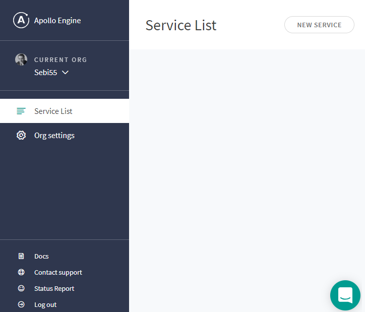
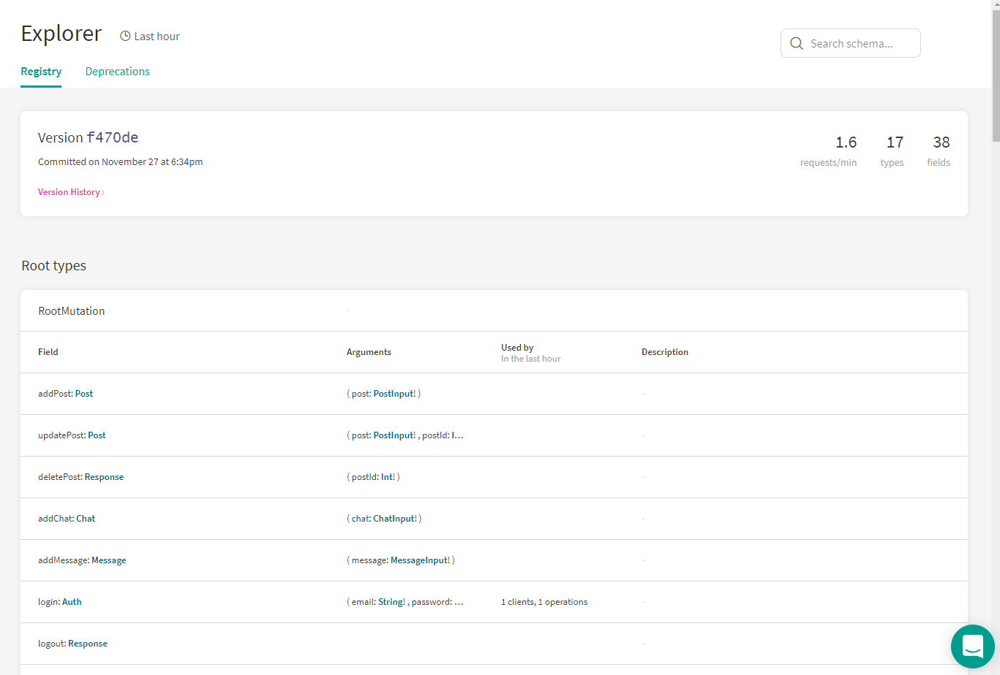
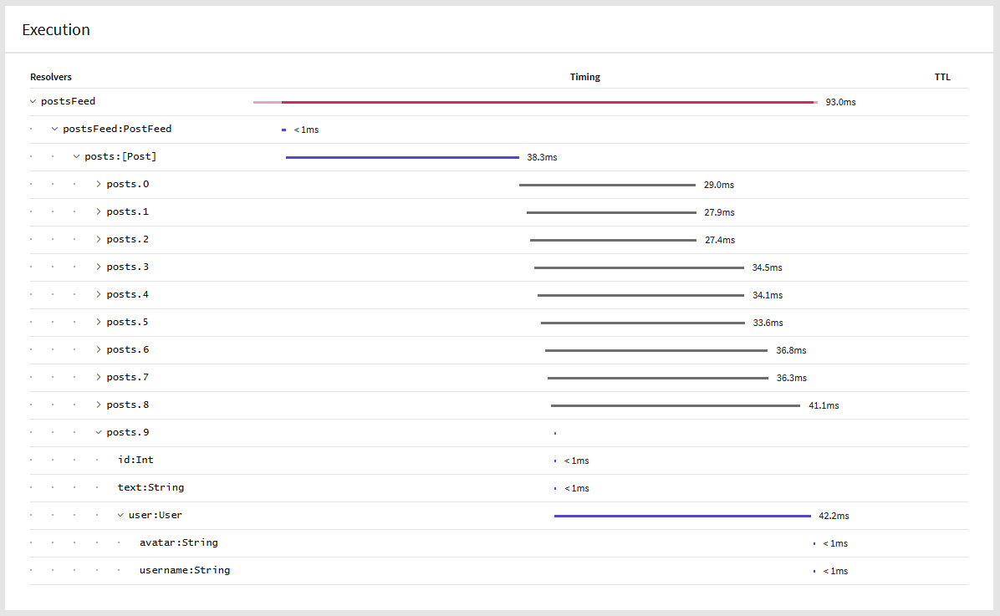
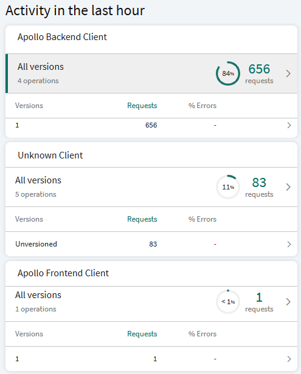
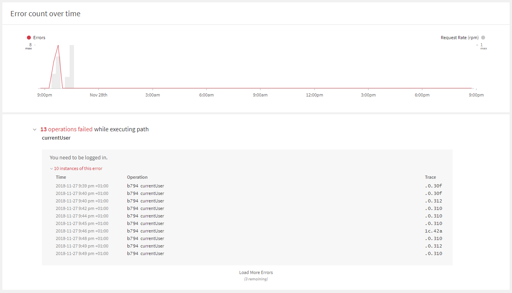

Lab 12: Optimizing GraphQL with Apollo Engine
=====================================


This lab covers the following topics:

-   Setting up Apollo Engine
-   Schema analysis
-   Performance analytics
-   Error tracking


### Lab Solution

Complete solution for this lab is available in the following directory:

`cd ~/Desktop/react-graphql-course/labs/Lab12`

Install following command to install all required packages:

`npm install`

Setting up Apollo Engine
========================

Apollo Engine provides many great features, which we\'ll explore in this
lab. Before moving on, however, you need to sign up for an Apollo
Engine account. Apollo Engine is a commercial product produced by
**MDG**, the **Meteor** **Development Group**, the company behind
Apollo.

They offer three different plans, which you can
find by going to <https://www.apollographql.com/plans/>. When signing
up, you get a two-week trial of the Team plan, which is one of the paid
plans. Afterward, you\'ll be downgraded to the free plan. You should
compare all three plans to understand how they differ---they\'re all
worth checking out.

To sign up, visit <https://engine.apollographql.com/login>. Currently,
you can only sign up using a GitHub account. If you don\'t have one
already, create a GitHub account at
[https://https://github.com/join](https://github.com/join).


After logging in, you will see a dashboard that looks as follows:




The next step is to add a service with the [NEW SERVICE]
button in the top-right corner. The first thing you need to enter is a
unique id for your service across all [Apollo Engine]
services. This id will be auto generated through the organization you
select, but can be customized. Secondly, you will be asked to publish
your GraphQL schema to [Apollo Engine]. Publishing your
GraphQL schema means that you upload your schema to Apollo Engine so
that it can be processed. It won\'t get publicized to external users.
You can do this using the command provided by Apollo Engine. Copy it
directly from the website and execute it. For me, this command looked as
follows:

```
npx apollo service:push --endpoint="http://localhost:8000/graphql" --key="YOUR_KEY"
```


The preceding [endpoint] must match your GraphQL route. The
[key] comes from Apollo Engine itself, so you don\'t generate it
on your own. Before running the preceding command, you have to start the
server, otherwise the GraphQL schema isn\'t accessible. Once you\'ve
uploaded the schema, Apollo Engine will redirect you to the service you
just set up.

**ProTip**

Notice that the GraphQL introspection feature needs to be enabled.
Introspection means that you can ask your GraphQL API which operations
it supports.


Introspection is only enabled when you run your Apollo Server in a
development environment, or if you explicitly enable introspection in
production. I highly discourage this because it involves giving away
information about queries and mutations that are accepted by your back
end. However, if you want to enable it, you can do this by setting the
[introspection] field when initializing Apollo Server. It can be
added inside the `index.js` file of the [graphql] folder:

```
const server = new ApolloServer({
  schema: executableSchema,
  introspection: true,
```


Ensure that you remove the [introspection] field when deploying
your application.

If you aren\'t able to run the GraphQL server, you also have the ability
to specify a schema file. Once you publish the GraphQL schema, the setup
process for your Apollo Engine service should be done. We\'ll explore
the features that we can now use in the following sections of this
lab. Before doing this, however, we have to change one thing on the
back end to get Apollo Engine working with our back end. We already used
our API Key to upload our GraphQL schema to Apollo Engine. Everything,
such as error tracking and performance analysis, relies on this key. We
also have to insert it in our GraphQL server. If you entered a valid API
key, all requests will be collected in Apollo Engine.

Open `index.js` in the server\'s [graphql] folder and add
the following object to the [ApolloServer] initialization:

```
engine: {
  apiKey: ENGINE_KEY
}
```


The [ENGINE\_KEY] variable should be extracted from the
environment variables at the top of the file. We also need to extract
[JWT\_SECRET] with the following line:

```
const { JWT_SECRET, ENGINE_KEY } = process.env;
```


Verify that everything is working by running some GraphQL requests. You
can view all past requests by clicking on the [Clients]
tab in Apollo Engine. You should see that a number of requests happened,
under the [Activity in the last hour] panel. If this
isn\'t the case, there must be a problem with the Apollo Server
configuration.

**ProTip**

There are many advanced options you can configure with Apollo Engine.
You can find the appropriate documentation at
<https://www.apollographql.com/docs/engine/>.


The basic setup is finished now. Apollo Engine doesn\'t support
subscriptions at the time of writing; it can only track normal HTTP
operations. Let\'s now take a closer look at the features of Apollo
Engine.


Analyzing schemas with Apollo Engine
====================================

The Community plan of Apollo Engine offers schema registry and explorer
tools. You can find them by clicking on the [Explorer]
tab in the left-hand panel. If your setup has gone well, the page should
look as follows:





Let\'s take a closer look at this screenshot:

-   On the page, you see the last GraphQL schema that you have
    published. Each schema you publish has a unique version, as long as
    the schema includes changes.
-   Beneath the version number, you can see your entire GraphQL schema.
    You can inspect all operations and types. All relations between
    types and operations are directly linked to each other.
-   You can directly see the number of clients and various usage
    statistics next to each operation, type, and field.
-   You can search through your GraphQL schema in the top bar and filter
    the usage statistics in the panel on the right.


I have created an example for you in the following screenshot:


Here, I published an initial version of our current GraphQL schema.
Afterward, I added a [demonstration] type with one field, called
[example]. On the right-hand side, you can see the schema
difference between the initial and second releases of the GraphQL
schema.

Viewing your schema inside Apollo Engine, including the history of all
previous schemas, is very useful. In the next section, we\'ll cover how
Apollo Engine enables you to get detailed metrics about the performance
of your GraphQL API.


Performance metrics with Apollo Engine
======================================

When your application is live and heavily used, you can\'t check the
status of every feature yourself; it would lead to an impossible amount
of work. Apollo Engine can tell you how your GraphQL API is performing
by collecting statistics with each request that\'s received. You always
have an overview of the general usage of your application, the number of
requests it receives, the request latency, the time taken to process
each operation, the type, and also each field that is returned. Apollo
Server can provide these precise analytics, since each field is
represented in a [resolver] function. The time elapsed to resolve
each field is then collected and stored inside Apollo Engine.

At the top of the [Metrics] page, you have four tabs. The
first tab will look as follows:


If your GraphQL API is running for more than a day, you\'ll receive an
overview that looks like the one here. The left-hand graph shows you the
request rate over the last day. The graph in the middle shows the
service time, which sums up the processing time of all requests. The
right-hand graph gives you the amount of errors, along with the queries
that caused them.

Under the overview, you\'ll find details about the current day,
including the requests per minute, the request latency over time, and
the request latency distribution:

-   **Requests Per Minute** (**rpm**) is useful when your API is used
    very often. It indicates which requests are sent more often than
    others.
-   The latency over time is useful when the requests to your API take
    too long to process. You can use this information to look for a
    correlation between the number of requests and increasing latency.
-   The request-latency distribution shows you the processing time and
    the amount of requests. You can compare the number of slow requests
    with the number of fast requests in this chart.

In the right-hand panel of Apollo Engine, under
[Metrics], you\'ll see all your GraphQL operations. If
you select one of these, you can get even more detailed statistics.

Now, switch to the [Traces] tab at the top. The first
chart on this page looks as follows:


The latency distribution chart shows all the different latencies for the
currently-selected operation, including the number of sent requests with
that latency. In the preceding example, I used the [postsFeed]
query.

Each request latency has its own execution timetable. You can see it by
clicking on any column in the preceding chart. The table should look
like the following screenshot:





The execution timetable is a big foldable tree. It starts at the top
with the root query, [postsFeed], in this case. You can also see
the overall time it took to process the operation. Each resolver
function has got its own latency, which might include, for example, the
time taken for each post and user to be queried from the database. All
the times from within the tree are summed up and result in a total time
of about 90 milliseconds.


Next, we\'ll see how Apollo Engine implements error tracking.


Error tracking with Apollo Engine
=================================

We\'ve already looked at how to inspect single operations using Apollo
Engine. Under the [Clients] tab, you will find a separate
view that covers all client types and their requests:


In this tab, you can directly see the percentage of errors that happened
during each operation. In the [currentUser] query, there were
[37.14%] errors out of the total [currentUser]
requests.

If you take a closer look at the left-hand side of the image, you will
see that it says [Unidentified clients]. Since version
2.2.3 of Apollo Server, client awareness is supported. It allows you to
identify the client and track how consumers use your API. Apollo
automatically extracts an [extensions] field inside each GraphQL
operation, which can hold a name and version. Both
fields---[Name] and [Version]---are then
directly transferred to Apollo Engine. We can filter by these fields in
Apollo Engine. We will have a look at how to implement this in our back
end next.

In this example, we\'ll use HTTP header fields to track the client type.
There will be two header fields: [apollo-client-name] and
[apollo-client-version]. We\'ll use these to set custom values to
filter requests later in the [Clients] page. Open the
`index.js` file from the [graphql] folder. Add the following
function to the [engine] property of the [ApolloServer]
initialization:

```
engine: {
  apiKey: ENGINE_KEY,
  generateClientInfo: ({
    request
  }) => {
    const headers = request.http.headers;
    const clientName = headers.get('apollo-client-name');
    const clientVersion = headers.get('apollo-client-version');

    if(clientName && clientVersion) {
      return {
        clientName,
        clientVersion
      };
    } else {
      return {
        clientName: "Unknown Client",
        clientVersion: "Unversioned",
      };
    }
  },
},
```


The [generateClientInfo] function is executed with every request.
We extract the two fields from the header. If they exist, we return an
object with the [clientName] and [clientVersion] properties
that have the values from the headers. Otherwise, we return a static
[Unkown Client] text.

To get both of our clients -- the front end and back end -- set up, we
have to add these fields. Perform the following steps:

1.  Open the `index.js` file of the client\'s [apollo]
    folder file.
2.  Add a new [InfoLink] to the file to set the two new header
    fields:

```
const InfoLink = (operation, next) => {
  operation.setContext(context => ({
    ...context,
    headers: {
      ...context.headers,
      'apollo-client-name': 'Apollo Frontend Client',
      'apollo-client-version': '1'
    },
  }));

  return next(operation);
};
```


Like [AuthLink], this link will add the two new header fields next
to the authorization header. It sets the version header to [\'1\']
and the name of the client to [\'Apollo Frontend Client\']. We
will see both in Apollo Engine soon.

3.  Add [InfoLink] in front of [AuthLink] in the
    [ApolloLink.from] function.
4.  On the back end, we need to edit the [apollo.js] file in the
    [ssr] folder:

```
const InfoLink = (operation, next) => {
  operation.setContext(context => ({
    ...context,
    headers: {
      ...context.headers,
      'apollo-client-name': 'Apollo Backend Client',
      'apollo-client-version': '1'
    },
  }));

return next(operation);
};
```


5.  The link is almost the same as the one for the front end, except
    that we set another [apollo-client-name] header. Add it just
    before [AuthLink] in the [ApolloLink.from] function.

The client name differs between the front end and back end code so you
can compare both clients inside Apollo Engine. If you execute some
requests from the back end and front end, you can see the result of
these changes directly in Apollo Engine. Here, you can see an example of
how that result should look:





At the top of the screenshot, we see the number of requests the back end
has made. In the middle, all the clients that we have no further
information on are listed, while at the bottom, we can see all requests
that have been made by the client-side code. Unknown clients might be
external applications that are accessing your API.

When releasing a new version of your application, you can increase the
version number of the client. The version number represents another
comparable field.

We now know which clients have accessed our API from the information
provided by Apollo Engine. Let\'s take a look at what Apollo Engine can
tell us about errors.

When you visit the [Error] tab, you will be presented
with a screen that looks like the following screenshot:





The first chart shows the number of errors over a timeline. Under the
graph, you can see each error with a timestamp and the stack trace. You
can follow the link to see the trace in detail, with the location of the
error. If you paid for the Team plan, you can also set alerts when the
number of errors increases or the latency time goes up. You can find
these alerts under the [Integrations] tab.

Next, we\'ll see how to improve the performance of our GraphQL API.


Caching with Apollo Server and the Client
=========================================

Apollo provides **Automatic Persisted Queries** (**APQ**), which is a
technique that significantly reduces bandwidth usage and carries out
caching through unique IDs per request. The workflow of this technique
is as follows:

1.  The client sends a hash instead of the full query string.
2.  Apollo Server tries to find this hash inside its cache.
3.  If the server finds the corresponding query string to the hash,
    it\'ll execute it and respond with its result.
4.  If the server doesn\'t find the hash inside its cache, it\'ll ask
    the client to send the hash along with the actual query string. The
    back end will then save this hash with the query string for all
    future requests and respond to the client\'s request.

There are two server-side changes that we have to do. One is in the
initialization of Apollo Server. Extend the graphql `index.js` by
adding the following two parameters to the [ApolloServer] options:

```
cacheControl: {
  defaultMaxAge: 5,
  stripFormattedExtensions: false,
  calculateCacheControlHeaders: true,
},
```


The [cacheControl] object sets [cacheControl] properties for
all our requests. The standard time inserted in this case is 5 seconds.
Using cache control, you can also store public GraphQL requests inside a
CDN to improve performance.


The second change is to enable cache control in the GraphQL schema. Just
copy the following code into the [schema.js] file:

```
enum CacheControlScope {
  PUBLIC
  PRIVATE
}

directive @cacheControl (
  maxAge: Int
  scope: CacheControlScope
) on FIELD_DEFINITION | OBJECT | INTERFACE
```


We have to add the preceding lines of code because there seems to be a
problem with the [makeExecutableSchema] function, which removes
the [\@cacheControl] directive. By adding it in our schema, we add
our custom directive, which we can use.

If you now execute any query, the response will include an extensions
object that looks like the following example:


In this case, the [maxAge] field has been applied to each
layer of our GraphQL request. As you can see, the users in the third
layer and the avatar images all have different maximum ages when
compared to the posts. You can define the [maxAge] per
type and field specifically.

If you open your [schema.js] file, you can change your
[User] type to reflect the preceding screenshot, as follows:

```
type User @cacheControl(maxAge: 120) {
  id: Int
  avatar: String @cacheControl(maxAge: 240)
  username: String
  email: String
}
```


The [\@cacheControl] directive takes care of all of this
internally in Apollo Server.

To persist our queries, we have to change some aspects of our SSR code.
Before we do this, however, we need to install a package using npm:

```
npm install --save apollo-link-persisted-queries
```


This package provides a special Apollo Client link to use persisted
queries. Import it at the top of both the [apollo.js] file in the
[ssr] folder and the `index.js` in the [apollo] folder
of the client:

```
import { createPersistedQueryLink } from 'apollo-link-persisted-queries';
```


We\'ll now create a new link with the [createPersistedQueryLink]
function and then connect it with our existing [HttpLink], which
is initialized by the [createUploadLink] function. The following
snippet shows how this can be implemented for the client-side code:

```
const httpLink = createPersistedQueryLink().concat(createUploadLink({
  uri: location.protocol + '//' + location.hostname + port + 
  '/graphql',
  credentials: 'same-origin',
}));
```


We execute the [createPersistedQueryLink] function and then use
the [concat] function for our [UploadLink]. The result is
then normally inserted into the [split] function, which is used to
decide between the WebSocket link and [UploadLink].

The SSR-related code looks pretty similar, but the function is directly
executed within the [Apollo.from] function instead. In the
[apollo.js] file from the [apollo] folder, replace the
initialization of [HttpLink] with the following code:

```
createPersistedQueryLink().concat(new HttpLink({
  uri: 'http://localhost:8000/graphql',
  credentials: 'same-origin',
  fetch
}));
```


As you know, we don\'t have [UploadLink] on the server side, so
we\'re using the normal [HttpLink] instead. A GraphQL request will
now include a hash instead of the regular query string on the first try.
You can see an example in the following screenshot:


The [variables] are of course included, because they can change
dynamically, but the query will always be the same. The server will try
to find the hash or let the client resend the complete [query]
string. This solution will save you and your users a significant amount
of bandwidth and, as a result, speed up API requests.


Summary
=======

In this lab, we learned how to sign up to and set up Apollo Engine.
You should now understand all the features that Apollo Engine provides
and how to make use of collected data. We also looked at how to set up
[cacheControl] and Automatic Persisted Queries to improve the
performance of your application.
