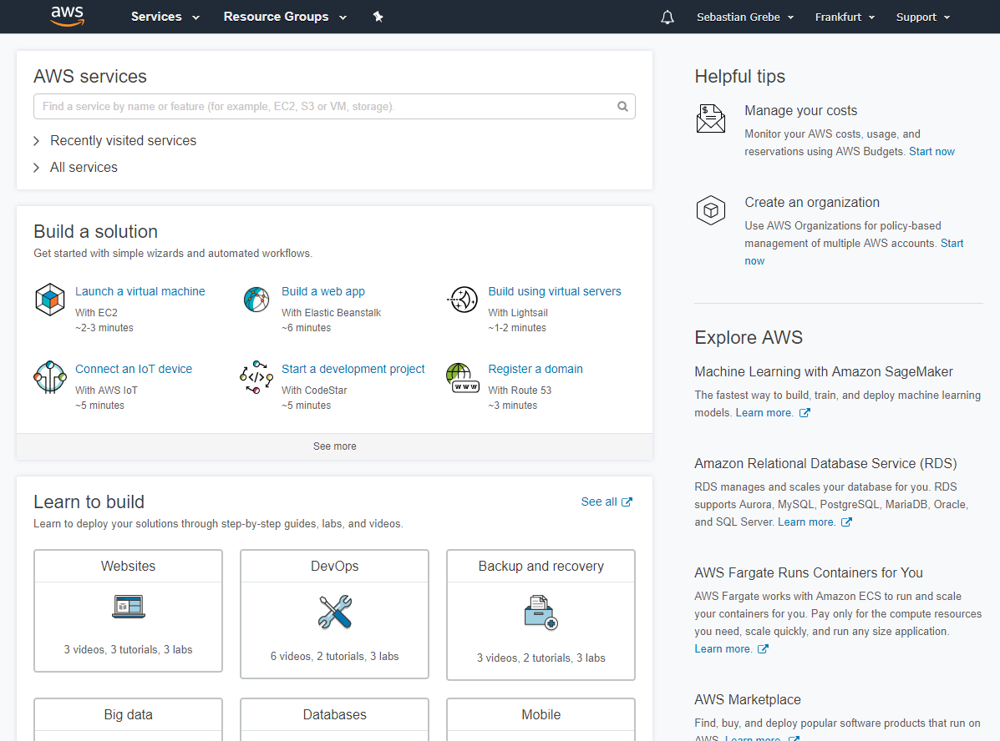
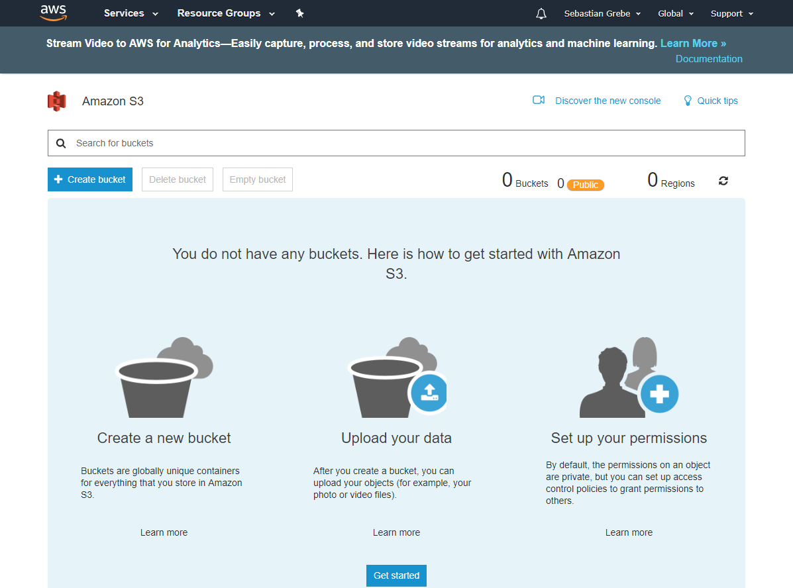
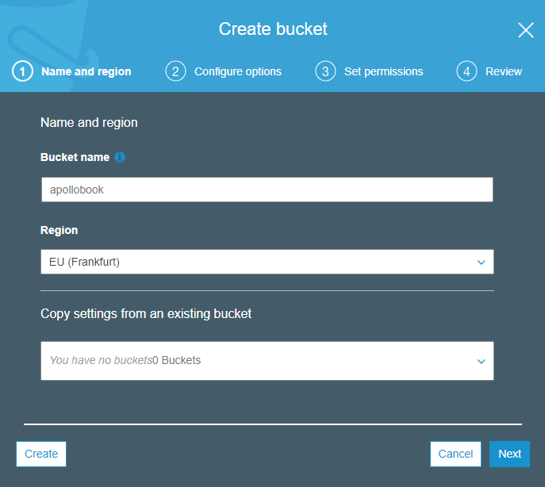
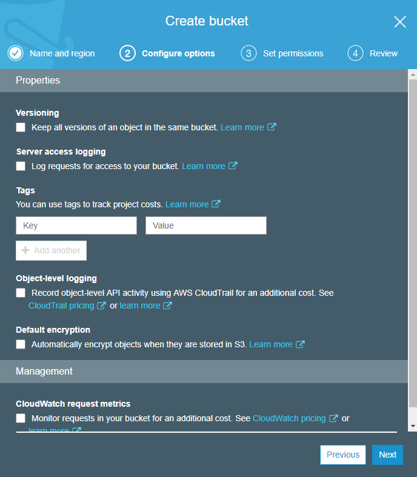
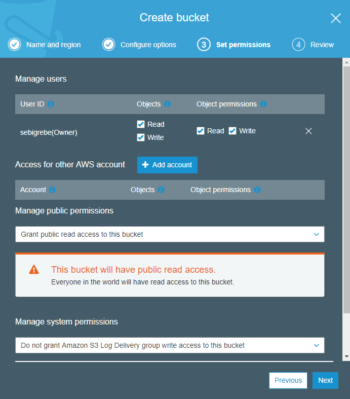
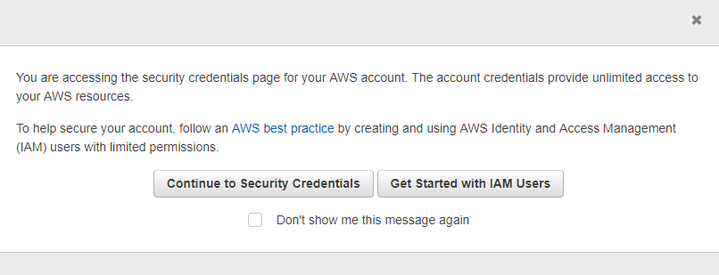
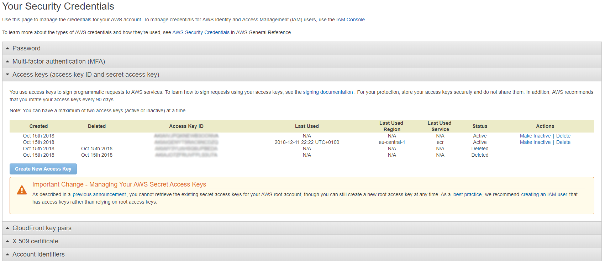
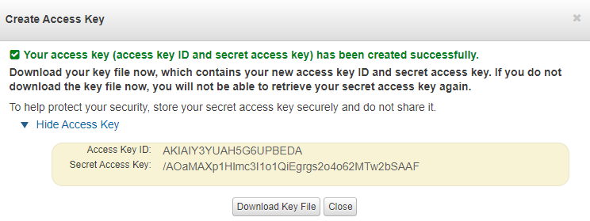
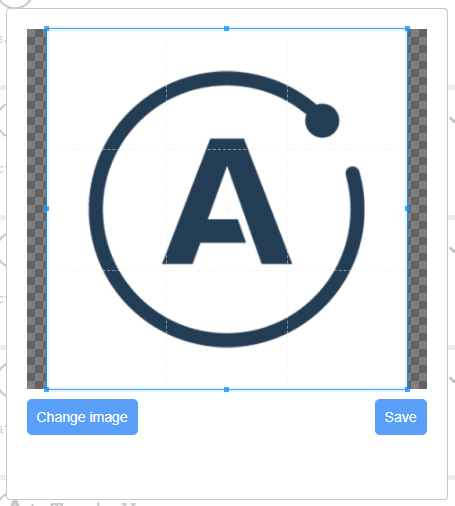

Lab 7: Handling Image Uploads
======================

All social networks have one thing in common: each of them allows their
users to upload custom and personal pictures, videos, or any other kind
of document. This feature can take place inside chats, posts, groups, or
profiles. To offer the same functionality, we are going to implement an
image upload feature in Graphbook.

This lab will cover the following topics:

-   Setting up Amazon Web Services
-   Configuring an AWS S3 bucket
-   Accepting file uploads on the server
-   Uploading images with React through Apollo
-   Cropping images


### Lab Solution

Complete solution for this lab is available in the following directory:

`cd ~/Desktop/react-graphql-course/labs/Lab07`


Setting up Amazon Web Services
==============================


Before continuing with this lab, you will be required to have an
account for Amazon Web Services. You can create one on the official web
page at <https://aws.amazon.com/>. For this, you will need a valid
credit card; you can also run nearly all of the services on the free
tier while working through this course without facing any problems.

Once you have successfully registered for AWS, you will see the
following dashboard. This screen is called the Amazon Web Services
Console:





The next section will cover the options for storing files with AWS.


Creating an AWS S3 bucket
-------------------------

For this lab, we will require a storage service to save all uploaded
images. AWS provides different storage types, for various use cases. In
our scenario of a social network, we will have dozens of people
accessing many images at once. **AWS Simple Storage Service** (**AWS
S3**) is the best option for our scenario.

You can visit the S3 screen by clicking on the [Services]
drop-down menu at the top of the page, and then looking under the
[Storage] category in the drop-down menu. There, you will
find the link to S3. Having clicked on it, the screen will look as
follows:





In S3, you create a bucket inside of a specific AWS region, where you
can store files.

The preceding screen provides many features for interacting with your S3
bucket. You can browse all of the files, upload your files via the
management interface, and configure more settings.

We will now create a new bucket for our project by clicking on [Create
Bucket] in the upper-left corner, as shown in the
preceding screenshot. You will be presented with a formula, as shown in
the following screenshot. To create the bucket, you must fill it out:





The bucket has to have a unique name across all buckets in S3. Then, we
need to pick a region. For me, [EU (Frankfurt)] is the
best choice, as it is the nearest origin point. Choose the best option
for you, since the performance of a bucket corresponds to the distance
between the region of the bucket and its accessor.

Once you have picked a region, continue by clicking on
[Next]. You will be confronted with a lot of new options:





For our use case, we will not select any of these options, but they can
be helpful in more advanced scenarios. AWS offers many features, such as
a complete access log and versioning, which you can configure in this
menu.


Move on with the creation of the bucket by clicking on
[Next].

This step defines the permissions for other AWS users, or the public.
Under [Manage public permissions], you have to select
[Grant public read access to this bucket] to enable
public access to all files saved in your S3 bucket. Take a look at the
following screenshot to ensure that everything is correct:





Finish the setup process by clicking on [Next], and then
[Create bucket]. You should be redirected to your empty
bucket.


Generating AWS access keys
--------------------------

Before implementing the upload feature, we must create an AWS API key to
authorize our back end at AWS, in order to upload new files to the S3
bucket.

Click on your username in the top bar of AWS. There, you find a tab
called [My Security Credentials], which navigates to a
screen offering various options to secure access to your AWS account.

You will probably be confronted with a dialog box like the following:





You can click on [Continue to Security Credentials] to
continue. It is generally recommended to use **AWS Identity and Access
Management** (**IAM**). It allows you to efficiently manage secure
access to AWS resources with separate IAM users. Throughout this course,
we are going to use the root user in the same way that we are now, but I
recommend looking at AWS IAM when writing your next application.

You should now see the credentials page, with a big list of different
methods for storing credentials. This should look like the following
screenshot:





In the list, expand the tab titled [Access keys] shown in
the preceding screenshot. In this tab, you will find all access tokens
for your AWS account.

To generate a new access token, click on [Create New Access
Key]. The output should look as follows:





The best practice is to download the key file as prompted, and save it
somewhere securely, just in case you lose the key at any time. You
cannot retrieve access keys again after closing the window; so, if you
lose them, you will have to delete the old key and generate a new one.


As you can see in the preceding screenshot, AWS gives us two tokens.
Both are required to gain access to our S3 bucket.

Now, we can start to program the uploading mechanism. Let\'s start by implementing the upload process on the back end.


GraphQL image upload mutation
-----------------------------

When uploading images to S3, it is required to use an API key, which we
have already generated. Because of this, we cannot directly upload the
files from the client to S3 with the API key. Anyone accessing our
application could read out the API key from the JavaScript code and
access our bucket without us knowing.

Uploading images directly from the client into the bucket is generally
possible, however. To do this, you would need to send the name and type
of the file to the server, which would then generate a URL and
signature. The client can then use the signature to upload the image.
This technique results in many round-trips for the client, and does not
allow us to post-process the image, such as by converting or
compressing, if needed.

The better solution is to upload the images to our server, have the
GraphQL API accept the file, and then make another request to
S3---including the API key---to store the file in our bucket.

We have to prepare our back end to communicate with AWS and accept file
uploads. The preparation steps are as follows:

1.  Interact with AWS to install the official [npm] package. It
    provides everything that\'s needed to use any AWS feature, not just
    S3:

```
npm install --save aws-sdk
```


2.  The next thing to do is edit the GraphQL schema and add a [scalar
    Upload] to the top of it. The [scalar] is used to
    resolve details such as the MIME type and encoding when uploading
    files:

```
scalar Upload
```


3.  Add the [File] type to the schema. This type returns the
    filename and the resulting URL under which the image can be accessed
    in the browser:

```
type File {
  filename: String!
  url: String!
}
```


4.  Create the new [uploadAvatar] mutation. It is required that
    the user is logged in to upload avatar images, so append the
    [\@auth] directive to the mutation. The mutation takes the
    previously mentioned [Upload] scalar as input:

```
uploadAvatar (
  file: Upload!
): File @auth
```


5.  Next, we will implement the mutation\'s resolver function in the
    [resolvers.js] file. For this, we will import and set up our
    dependencies at the top of the [resolvers.js] file, as
    follows:

```
import aws from 'aws-sdk';
const s3 = new aws.S3({
  signatureVersion: 'v4',
  region: 'eu-central-1',
});
```


We will initialize the [s3] object that we will use to upload
images in the next step. It is required to pass a [region], like
the instance in which we created the bucket. We set the
[signatureVersion] to version [\'v4\'], as this is
recommended.

**ProTip**

You can find details about the signature process of AWS requests at
<https://docs.aws.amazon.com/general/latest/gr/signature-version-4.html>.


6.  Inside the [mutation] property, insert the
    [uploadAvatar] function, as follows:

```
async uploadAvatar(root, { file }, context) {
  const { stream, filename, mimetype, encoding } = await file;
  const bucket = 'apollobook';
  const params = {
    Bucket: bucket,
    Key: context.user.id + '/' + filename,
    ACL: 'public-read',
    Body: stream
  };
  
  const response = await s3.upload(params).promise();

  return User.update({
    avatar: response.Location
  },
  {
    where: {
      id: context.user.id
    }
  }).then(() => {
    return {
      filename: filename,
      url: response.Location
    }
  });
},
```


In the preceding code, we start by specifying the function as
[async], so that we can use the [await] method to resolve
the file and its details. The result of the resolved [await file]
method consists of the properties [stream], [filename],
[mimetype], and [encoding].

Then, we collect the following parameters in the [params]
variable, in order to upload our avatar image.

The [params] variable is given to the [s3.upload] function,
which saves the file to our bucket. We directly chain the
[promise] function onto the [upload] method. In the
preceding code, we use the [await] statement to resolve the
promise returned by the upload function. Therefore, we specified the
function as [async]. The [response] object of the AWS S3
upload includes the public URL under which the image is accessible for
everyone.

The last step is to set the new avatar picture on the user in our
database. We execute the [User.update] model function from
Sequelize by setting the new URL from [response.Location], which
S3 gave us after we resolved the promise.

An example link to an S3 image is as follows:

```
https://apollobook.s3.eu-central-1.amazonaws.com/1/test.png
```


As you can see, the URL is prefixed with the name of the bucket and then
the region. The suffix is, of course, the folder, which is the user id
and the filename. The preceding URL will differ from the one that your
back end generates, because your bucket name and region will vary.

After updating the user, we can return the AWS response to update the UI
accordingly, without refreshing the browser window.

In the previous section, we generated the access tokens, in order to
authorize our back end at AWS. By default, the AWS SDK expects both
tokens to be available in our environment variables. Like we did before
with the [JWT\_SECRET], we will set the tokens as follows:

```
export AWS_ACCESS_KEY_ID=YOUR_AWS_KEY_ID
export AWS_SECRET_ACCESS_KEY=YOUR_AWS_SECRET_KEY
```


Insert your AWS tokens into the preceding code. The AWS SDK will detect
both environment variables automatically. We do not need to read and
configure them anywhere in our code.

We will now continue and implement all of the image upload features in
the front end.


React image cropping and uploading
----------------------------------

In social networks such as Facebook, there are multiple locations where
you can select and upload files. You can send images in chats, attach
them to posts, create galleries in your profile, and much more. For now,
we will only look at how to change our user\'s avatar image. This is a
great example for easily showing all of the techniques.

The result that we are targeting looks like the following screenshot:


The user can select a file, crop it directly in the modal, and save it
to AWS with the preceding dialog.

I am not a big fan of using too many [npm] packages, as this often
makes your application unnecessarily big. As of writing this course, we
cannot write custom React components for everything, such as displaying
dialog or cropping, no matter how easy it might be.

To get the image upload working, we will install two new packages. To do
this, you can follow these instructions:

1.  Install the packages with [npm]:

```
npm install --save react-modal @synapsestudios/react-drop-n-crop
```


The [react-modal] package offers various dialog options that you
can use in many different situations. The [react-drop-n-crop]
package is a wrapper package around [Cropper.js] and
[react-dropzone]. Personally, I dislike wrapper packages, since
they are often poorly maintained or leave features unimplemented.
Against all prejudice, this package does a really excellent job of
allowing users to drop images with [react-dropzone], and then
cropping them with the well-known [Cropper.js] library.

2.  When using the [react-drop-n-crop] package, we can rely on its
    included CSS package. In your main [App.js], import it
    straight from the package itself, as follows:

```
import '@synapsestudios/react-drop-n-crop/lib/react-drop-n-crop.min.css';
```


webpack takes care of bundling all assets, like we are already doing
with our custom CSS.

3.  The next package that we will install is an extension for the Apollo
    Client, which will enable us to upload files, as follows:

```
npm install --save apollo-upload-client
```


4.  To get the [apollo-upload-client] package running, we have to
    edit the [index.js] from the [apollo] folder where we
    initialize the Apollo Client and all of its links. Import the
    [createUploadLink] function at the top of the [index.js]
    file, as follows:

```
import { createUploadLink } from 'apollo-upload-client';
```


5.  You must replace the old [HttpLink] at the bottom of the link
    array with the new upload link. Instead of having a new
    [HttpLink], we will now pass the [createUploadLink], but
    with the same parameters. When executing it, a regular link is
    returned. The link should look like the following code:

```
createUploadLink({
  uri: 'http://localhost:8000/graphql',
  credentials: 'same-origin',
}),
```


It is important to note that when we make use of the new upload link and
send a file with a GraphQL request, we do not send the standard
[application/json] [Content-Type] request, but instead send
a [multi-part] [FormData] request. This allows us to upload
files with GraphQL. Standard JSON HTTP bodies, like we use with our
GraphQL requests, cannot hold any file objects.

**ProTip**

Alternatively, it is possible to send a [base64] instead of a file
object when transferring images. This procedure would save you from the
work that we are doing right now, as sending and receiving strings is no
problem with GraphQL. You have to convert the [base64] string to a
file if you want to save it in AWS S3. This approach only works for
images, however, and web applications should be able to accept any file
type.


6.  Now that the packages are prepared, we can start to implement our
    [uploadAvatar] mutation component for the client. Create a new
    file, called [uploadAvatar.js], in the [mutations]
    folder.
7.  At the top of the file, import all dependencies and parse all
    GraphQL requests with [graphql-tag] in the conventional way,
    as follows:

```
import React, { Component } from 'react';
import { Mutation } from 'react-apollo';
import gql from 'graphql-tag';

const GET_CURRENT_USER = gql`
  query currentUser { 
    currentUser { 
      id
      username
      avatar
    }
  }
`;

const UPLOAD_AVATAR = gql`
  mutation uploadAvatar($file: Upload!) {
    uploadAvatar(file : $file) {
      filename
      url
    }
  }
`;
```


As you can see, we have the [uploadAvatar] mutation, which takes
the [file] as a parameter of the [Upload] type. Furthermore,
we have the [currentUser] GraphQL query, which we are going to use
in the next step to update the avatar image without re-fetching all
queries, but only by updating the cache.

8.  Next, you can copy the [UploadAvatarMutation] class. It passes
    the [uploadAvatar] mutation function to the underlying
    children, and sets the newly uploaded avatar image inside of the
    cache for the [currentUser] query. It shows the new user
    avatar directly in the top bar when the request is successful:

```
export default class UploadAvatarMutation extends Component {
  render() {
    const { children } = this.props;
    return (
      <Mutation
        update = {(store, { data: { uploadAvatar } }) => {
          var query = {
            query: GET_CURRENT_USER,
          };
          const data = store.readQuery(query);
          data.currentUser.avatar = uploadAvatar.url;
          store.writeQuery({ ...query, data });
        }}
        mutation={UPLOAD_AVATAR}>
          {uploadAvatar => 
            React.Children.map(children, function(child){
              return React.cloneElement(child, { uploadAvatar });
            })
          }
      </Mutation>
    )
  }
}
```


The preceding code is nothing utterly new, as we used the same approach
for the other mutations that we implemented.

The preparation is now complete. We have installed all of the required
packages, configured them, and implemented the new mutation component.
We can begin to program the user-facing dialog to change the avatar
image.

For the purposes of this course, we are not relying on separate pages or
anything like that. Instead, we are giving the user the opportunity to
change his avatar when he clicks on his image in the top bar. To do so,
we are going to listen for the click event on the avatar, opening up a
dialog that includes a file dropzone and a button to submit the new
image.

Execute the following steps to get this logic running:

1.  It is always good to make your components as reusable as possible,
    so create an [avatarModal.js] file inside of the
    [components] folder.
2.  As always, you will have to import the two new [react-modal]
    and [react-drop-n-crop] packages first, as follows:

```
import React, { Component } from 'react';
import Modal from 'react-modal';
import DropNCrop from '@synapsestudios/react-drop-n-crop';

Modal.setAppElement('#root');

const modalStyle = {
  content: {
    width: '400px',
    height: '450px',
    top: '50%',
    left: '50%',
    right: 'auto',
    bottom: 'auto',
    marginRight: '-50%',
    transform: 'translate(-50%, -50%)'
  }
};
```


As you can see in the preceding code snippet, we tell the modal package
at which point in the browser\'s DOM we want to render the dialog, using
the [setAppElement] method. For our use case, it is okay to take
the [root] DOMNode, as this is the starting point of our
application. The modal is instantiated in this DOMNode.

The modal component accepts a special [style] parameter for the
different parts of the dropzone. We can style all parts of the modal by
specifying the [modalStyle] object with the correct properties.

3.  The [react-drop-n-crop] package enables the user to select or
    drop the file. Beyond this feature, it gives the user the
    opportunity to crop the image. The result is not a [file] or
    [blob] object, but a [data URI], formatted as
    [base64]. Generally, this is not a problem, but our GraphQL
    API expects that we sent a real file, not just a string, as we
    explained previously. Consequently, we have to convert the [data
    URI] to a blob that we can send with our GraphQL request. Add
    the following function to take care of the conversion:

```
function dataURItoBlob(dataURI) {
  var byteString = atob(dataURI.split(',')[1]);
  var mimeString = dataURI.split(',')[0].split(':')[1].split(';')
  [0];
  var ia = new Uint8Array(byteString.length);
 
  for (var i = 0; i < byteString.length; i++) {
    ia[i] = byteString.charCodeAt(i);
  }

  const file = new Blob([ia], {type:mimeString});
  return file;
}
```


Let\'s not get too deep into the logic behind the preceding function.
The only thing that you need to know it is that it converts all readable
ASCII characters into 8-bit binary data, and at the end, it returns a
blob object to the calling function. It converts data URIs to blobs.

4.  The new component that we are implementing at the moment is called
    [AvatarUpload]. It receives the [isOpen] property, which
    sets the modal to visible or invisible. By default, the modal is
    invisible. Furthermore, when the modal is shown, the dropzone is
    rendered inside. The [Modal] component takes an
    [onRequestClose] method, which executes the [showModal]
    function when the user tries to close the modal (by clicking outside
    of it, for example). We receive the [showModal] function from
    the parent component, which we are going to cover in the next step.

The [DropNCrop] component does not need any properties except for
the [onChange] event and the state variable as a default value.
The [value] of the [DropNCrop] component is filled with the
[AvatarUpload] component\'s state. The state only holds a default
set of fields that the [DropNCrop] component understands.

It tells the package to start with an empty dropzone. Switching between
file selection and cropping is handled by the package on its own:

```
export default class AvatarUpload extends Component {
  state = { 
    result: null,
    filename: null,
    filetype: null,      
    src: null,
    error: null,
  }
  onChange = value => {
    this.setState(value);
  }
  uploadAvatar = () => {
    const self = this;
    var file = dataURItoBlob(this.state.result);
    file.name = this.state.filename;
    this.props.uploadAvatar({variables: { file }}).then(() => {
      self.props.showModal();
    });
  }
  changeImage = () => {
    this.setState({ src: null });
  }
  render() {
    return (
      <Modal
        isOpen={this.props.isOpen}
        onRequestClose={this.props.showModal}
        contentLabel="Change avatar"
        style={modalStyle}
      >
        <DropNCrop onChange={this.onChange} value={this.state} />
        {this.state.src !== null && (
          <button className="cancelUpload" onClick=
          {this.changeImage}>Change image</button>
        )}
        <button className="uploadAvatar" onClick=
        {this.uploadAvatar}>Save</button>
      </Modal>
    )
  }
}
```


The `AvatarUpload` class receives an `isOpen` property from
its parent component. We directly pass it to the `DropNCrop`
component. Whenever the parent component changes the passed property\'s
value, the modal is either shown or not, based on the value.

When a file is selected or cropped, the component state is updated with
the new image. The response of the cropper package is saved in the
`result` state variable.

We are using the conditional rendering pattern to show a `Change
image` button when the `src` state variable is filled, which
happens when a file is selected. The `changeImage` function sets
the `src` of the `DropNCrop` component back to `null`,
which lets it switch back to the file selection mode.

When the user has finished editing his picture, he can hit the
`Save` button. The `uploadAvatar` method will be
executed. It converts the `base64` string returned from the
cropper component to a `blob` object, using the
`dataURItoBlob` function. We send the result with the GraphQL
request inside of the mutation\'s `variables` parameter. When the
request has finished, the modal is hidden again by running the
`showModal` functions from the properties.

5.  Now, switch over to the [user.js] file in the [bar]
    folder, where all of the other application bar-related files are
    stored. Import the mutation and the new [AvatarUpload]
    component that we wrote before, as follows:

```
import UploadAvatarMutation from '../mutations/uploadAvatar';
import AvatarUpload from '../avatarModal';
```


6.  The [UserBar] component is the parent of
    [AvatarUploadModal]. Open the [user.js] file from the
    [bar] folder. That is why we handle the [isOpen] state
    variable of the dialog in the [UserBar] class. We introduce an
    [isOpen] state variable and catch the [onClick] event on
    the avatar of the user. Copy the following code to the
    [UserBar] class:

```
state = {
  isOpen: false,
}
showModal = () => {
  this.setState({ isOpen: !this.state.isOpen });
}
```


7.  Replace the return value of the [render] method with the
    following code:

```
return (
  <div className="user">
    
    <UploadAvatarMutation>
      <AvatarUpload isOpen={this.state.isOpen} showModal={this.showModal}/>
    </UploadAvatarMutation>
    <span>{user.username}</span>
  </div>
);
```


The [UploadAvatarMutation] surrounds the modal component to pass
the mutation function over.

Furthermore, the modal component directly receives the [isOpen]
property, as we explained earlier. The [showModal] method is
executed when the avatar image is clicked. This function updates the
property of the [AvatarUpload] class, and either shows or hides
the modal.

Start the server and client with the matching [npm run] commands.
Reload your browser and try out the new feature. When an image is
selected, the cropping tool is displayed. You can drag and resize the
image area that should be uploaded. You can see an example of this in
the following screenshot:





Hitting [Save] uploads the image under the [user]
folder in the S3 bucket. Thanks to the Mutation component that we wrote,
the avatar image in the top bar is updated with the new URL to the S3
bucket location of the image.

The great thing that we have accomplished is that we send the images to
our server. Our server transfers all of the images to S3. AWS responds
with the public URL, which is then placed directly into the avatar field
in the browser. The way that we query the avatar image from the back
end, using our GraphQL API, does not change. We return the URL to the S3
file, and everything works.


Summary
=======

In this lab, we started by creating an AWS account and an S3 bucket
for uploading static images from our back end. Modern social networks
consist of many images, videos, and other types of files. We introduced
the Apollo Client, which allows us to upload any type of file. In this
lab, we managed to upload an image to our server, and we covered how
to crop images and save them through a server in AWS S3. Your
application should now be able to serve your users with images at any
time.

The next lab will cover the basics of client-side routing, with the
use of React Router.
